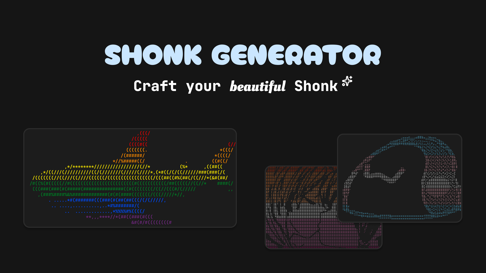
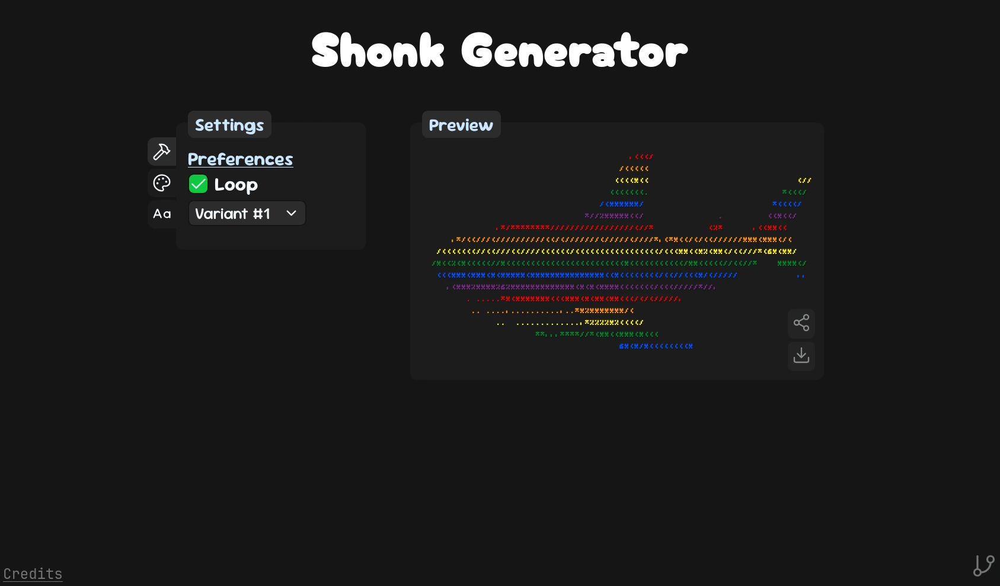

# Shonk Generator

This tool lets you apply different colors to a predefined Blåhaj variant or your own, custom ASCII-Art!

## Images

### Banner

### Interface

## Contributing

If you want to add a flag or update an existing one, simply open a pull request with the change in the [consts.js](./src/consts.js). You can also create an Issue to propose a change or suggest a new flag using the [Flag Addition template](https://github.com/Kolpixx/shonk-generator/issues/new?template=flag.yml).

## Credits

I copied the ASCII-Art for Variant #1 from [https://codeberg.org/GeopJr/BLAHAJ/src/branch/main/data/ascii.txt](https://codeberg.org/GeopJr/BLAHAJ/src/branch/main/data/ascii.txt), licensed under [BSD-2-Clause](./public/licenses/license-1.txt).

You can find all credits in the [CREDITS.md](./public/CREDITS.md) or at [https://shonk.netlify.app/credits](https://shonk.netlify.app/credits).

## License

This project is licensed under [MIT](https://github.com/Kolpixx/shonk-generator/blob/main/LICENSE)